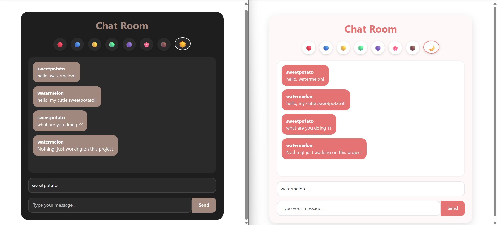

# real-time-chat-room
## 🌐 Live Demo

🔗 https://real-time-chat-room-production.up.railway.app/chat

## 📖 Project Overview

Real-Time Chat Room is a web application that enables instant communication between multiple users using WebSocket technology. Unlike traditional HTTP-based applications, WebSockets maintain a persistent connection between the client and server, allowing messages to be delivered in real time without page refreshes.

The application uses the STOMP protocol for structured message handling and SockJS to ensure compatibility across different browsers. It demonstrates the implementation of real-time communication, message broadcasting, and event-driven client-server interaction through a clean and responsive user interface.

## ✨ Features

- ⚡ Real-time message delivery
- 🔌 WebSocket-based communication
- 📡 STOMP messaging protocol
- 🌐 SockJS fallback support
- 👥 Multi-user chat functionality
- 🎨 Responsive and modern user interface
- 🚀 Cloud deployment using Railway
- 📱 Cross-browser compatibility

 

